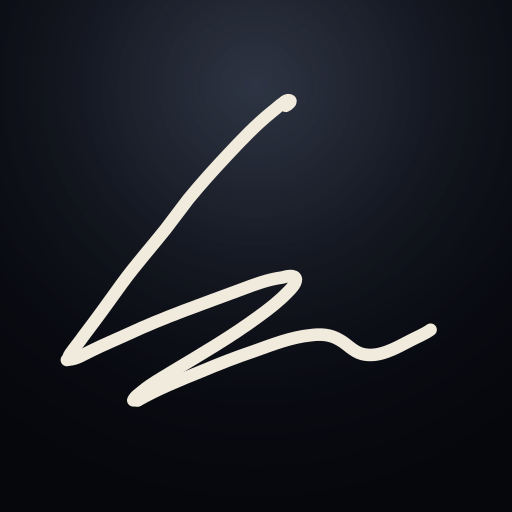

<p align="center">
  
</p>

<h1 align="center">guidotto.dev</h1>

<p align="center">
  <strong>A physics library. A map for tangled systems. Two productivity apps. A love letter.</strong><br>
  <sub>My portfolio &middot; Next.js 16 &middot; Tailwind CSS 4 &middot; Bun</sub>
</p>

<p align="center">
  <a href="https://github.com/giacomoguidotto/guidotto.dev/actions"></a>
  <a href="https://github.com/giacomoguidotto/guidotto.dev/blob/main/LICENSE"></a>
</p>

<br>

Most portfolios ask you to believe a sentence. I built `guidotto.dev` to let the work do the arguing.

It opens like a vitrine. The work sits under glass, a thesis line floats over it, and as you scroll the proof resolves from atmosphere into evidence. One viewport to feel the range, the rest of the page to verify it. No pitch you have to take on faith.

> A physics library. A map for tangled systems. Two productivity apps. A love letter.

That sentence is the whole site in one breath. Each piece is a different platform, a different language, a different reason to exist. The variety is the point: backend systems, native apps, shipped product, ML research, all from the same hands. Chasing ideas to make an impact, and shipping them.

<p align="center">
  <a href="https://guidotto.dev"><strong>Visit the site &rarr;</strong></a>
</p>

## What's under the glass

Selected work, each a different world:

- **Orray** &middot; `Platform · Go · Kubernetes` <br>
  A new way to navigate your system. Infrastructure you can finally see: a Go control plane and Kubernetes CRDs sit under a living canvas, so a cluster becomes a place you move through instead of a wall of dashboards. Still in early development.

- **Tempo** &middot; `Product · Android · Expo` <br>
  Find your rhythm during the day. An open-source app that nudges you toward what matters through the day, then shows you how well you kept to it. Soon on the Play Store.

- **Scry** &middot; `Product · macOS · Swift` <br>
  Circle to Search for macOS. A native Swift app that talks straight to macOS: global hotkeys, screen capture, Vision OCR, a floating answer panel, and Sparkle auto-updates. Installable today.

- **Ginevra Renier** &middot; `Product · Next.js · Convex` <br>
  The home for my love's photography. For her, the site becomes a canvas she can edit in real time. No friction between her and her work. My way of showing love through code.

## The centerpiece

**AnyPINN.** As order rises from chaos.

My machine learning library, running live in your browser. 300 real points, three little networks, and a neural net finding the law behind the noise. Open-source physics-informed neural networks, grown from a funded thesis, with public docs, CI, PyPI packaging, and a JOSS submission behind it.

## Where this is heading

To keep improving.

Software engineer at Danfoss since 2022, promoted from junior in two years. I kept pushing into new territory: frontend delivery, backend ownership, data pipelines, energy optimization, integration work. Now I'm building a Rust-based MQTT ingestion pipeline for datacenter cooling diagnostics, on a Kubernetes-hosted IoT platform large enough to matter for reliability.

Outside work too, I chase the harder, broader problems and shape them into products that improve people's lives.

> I'm Jack. Forever curious, always improving, never quite comfortable, and building something that matters.

## How it's built

The implementation is meant to stay quiet so the work stays loud. The hero is lightweight and reactive, so first paint is instant and the headline is the first thing you read. The single heavy interactive moment is saved for the centerpiece, where AnyPINN goes genuinely live. Everything else earns its color through attention.

| Tool | Purpose |
| --- | --- |
| [Next.js](https://nextjs.org) | Static-first App Router site |
| [Tailwind CSS](https://tailwindcss.com) | Visual system and interaction styling |
| [Bun](https://bun.sh) | Runtime, package manager, and CI entrypoint |
| [Biome](https://biomejs.dev) / [Ultracite](https://www.ultracite.ai) | Formatting and code quality |

```bash
bun install      # install dependencies
bun run dev      # start the dev server
bun run ci       # the canonical validation: lint, typecheck, build
```

## Contributing

Free and open source under the [MIT License](LICENSE). See [CONTRIBUTING.md](.github/CONTRIBUTING.md) for guidelines. Contributions are welcome where they improve implementation quality, accessibility, performance, or documentation without weakening the public-safe source boundary.

Agents should start at [AGENTS.md](AGENTS.md).
